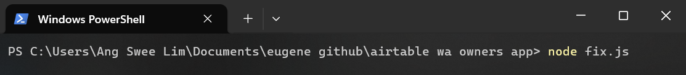
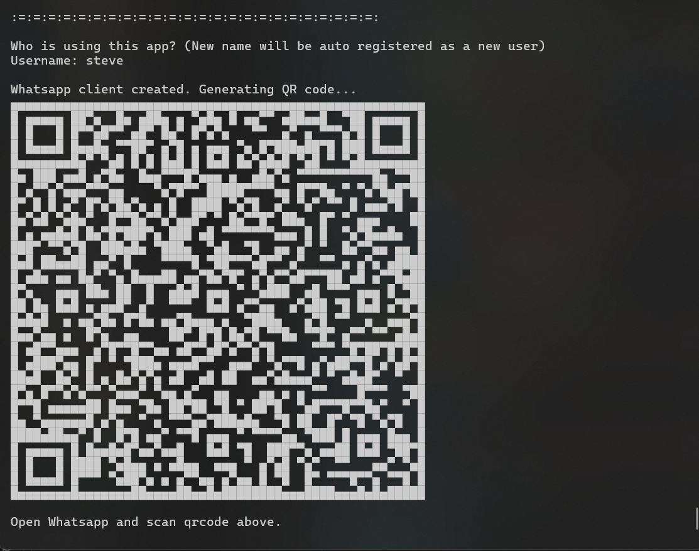
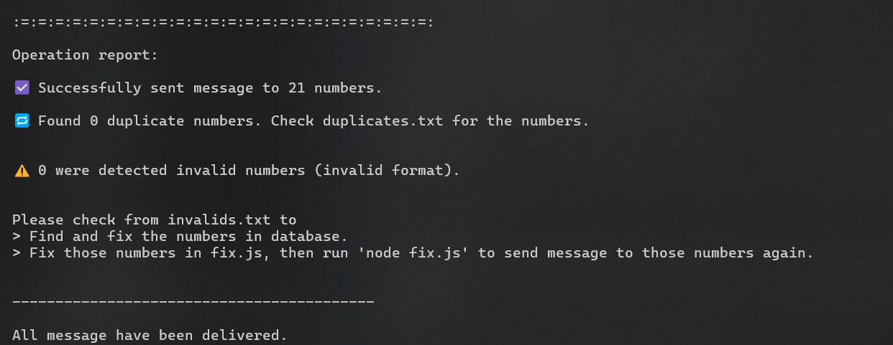

**Bulk Send WhatsApp Message Program**

Description: Bulk send whatsapp message, with or without image, to phone numbers listed in Airtable database.

## Installation
1. Download the repository (folder) into your own pc.
2. Download Node.js from [Node.js](https://nodejs.org/en/download/prebuilt-installer/current)
3. Open terminal in the project folder, then run `npm install` command (only for the first time).
4. Run `node index.js` command to start the program.

## Steps
1. First, enter a username. The username will be used next time for easy login to WhatsApp. New username will be prompted to scan WhatsApp Web QR code to log in.
2. For first-time user, open WhatsApp > Linked devices to scan the QR code.

3. Choose your group of target owners, whether are you sending to every owners or owners living in certain areas only. Enter the corresponding digit.
4. By choosing option 2, you will be prompted to enter the residential area name, separated by commas. Please make sure the spelling is correct.
5. Next, craft the message you want to send. You may send image only, text only, or both. For sending image, please first download your image into 'flyer' folder. Then, enter its relative path as demonstrated.
   
7. The time taken for the messages to be sent to all contacts will vary depending on the number of contacts. A operation report will be printed once the operation is done.

## IMPORTANT NOTE
1. Please do not alter the name of field in Airtable, as this will cause 'records not found' error.
2. The name of the residential area enterred must be spelling correct, but does not have to be capitalized.
3. Message are only sent to mobile contacts, i.e. the program will skip numbers begin with '03', '05', and etc.
4. Please do not alter the structure of the project files.

